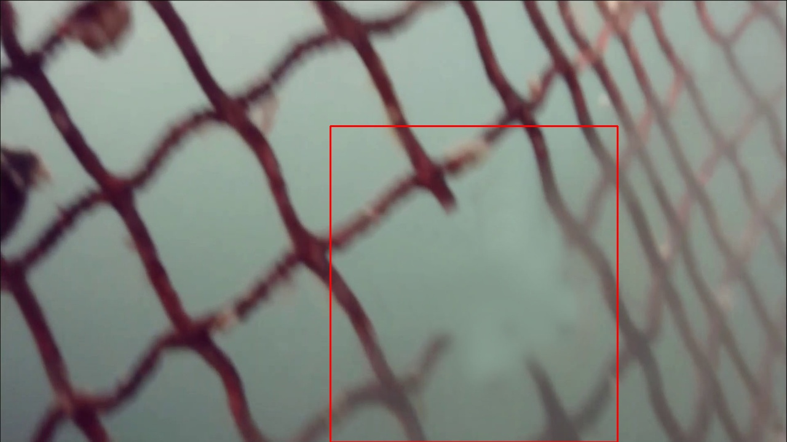

# 🐟 양식장 그물 파손 탐지

> C++과 OpenCV 기반으로 **양식장 그물(메쉬) 파손**을 자동 감지하는 프로젝트입니다.  
> `image/` 폴더 내 이미지를 입력으로 사용하며, Windows 실행 파일(`.exe`)도 포함되어 있어 바로 실행할 수 있습니다.

---

## 🔎 프로젝트 개요
- 입력된 이미지를 전처리(채널 연산, 블러, 임계처리, 형태학 연산 등)하여 **그물 패턴과 구멍 영역**을 분리합니다.
- 연결 컴포넌트 분석으로 각 구멍의 면적과 위치를 파악하고, **비정상적인 크기나 형태의 구멍**을 파손으로 판별합니다.
- 최종적으로 원본 이미지에 **빨간 사각형**을 표시하여 파손 부위를 시각적으로 보여줍니다.

---

## ⚙️ 요구 사항
- C++11 이상 지원 컴파일러
- OpenCV 3.x 또는 4.x

---
## 🧠 알고리즘 흐름

1. 채널 분리: BGR 채널 분리 후 R-G, G-R 연산

2. 전처리: 히스토그램 평활화 + 임계값 처리

3. 형태학 처리: Blackhat 연산으로 그물 강조

4. 합성 및 이진화: 전처리 결과 합성 후 반전 이진화

5. 연결 컴포넌트 분석: connectedComponentsWithStats로 구멍 탐지

6. 행/열 그룹화: 구멍 크기 평균 비교로 이상치 판별

7. 시각화: 파손 영역에 빨간 박스 표시
---

## ✅ 결과

---

## 📝 논문
[국내 학회지 게재 논문](10.14775/ksmpe.2024.23.08.033)

---
## ✨ 기여 & 문의

개선 아이디어나 버그 리포트는 Issues에 남겨주세요 😊

파라미터 조정, GUI 개선, 배치 실행 스크립트 등 기여 환영합니다!

