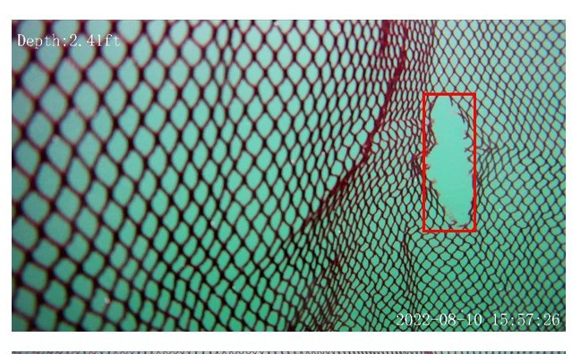
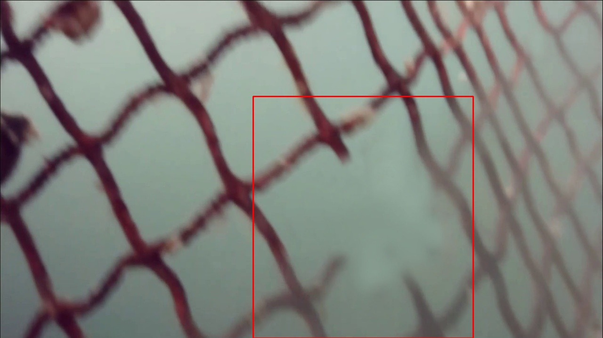
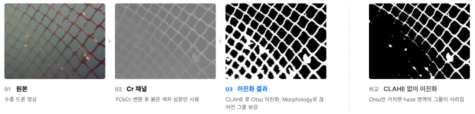
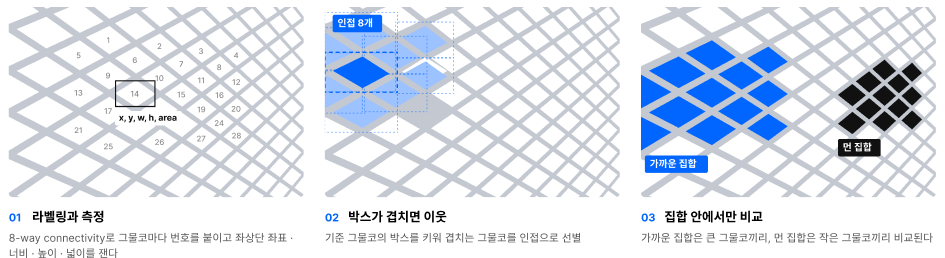
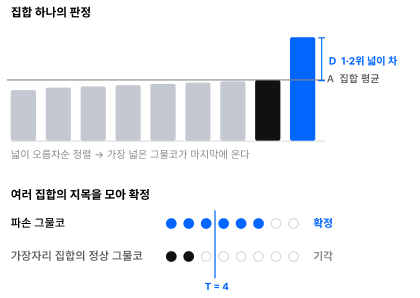
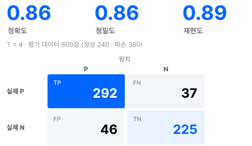

<div align="center">

<table>
  <tr>
    <td align="center"><br><sub>실제 파손 탐지 · 직접 파손을 낸 그물을 수중 촬영</sub></td>
    <td align="center"><br><sub>테스트 영상 탐지</sub></td>
  </tr>
</table>

### Mesh-hole Grouping · 양식장 그물 파손 탐지

> **연구 기간**: 2021. 09 ~ 2022. 12<br>
> **역할**: 알고리즘 설계 · 구현 · 평가 전체
>
> 수중 드론 영상에서 **그물코 넓이를 이웃끼리 비교**해 파손을 찾는<br>
> **원근 왜곡에 강한 그물 파손 탐지 알고리즘** (C++ · OpenCV)

| 성과 | 내용 |
|:---:|---|
| 📜 **특허 등록** | MHG 알고리즘을 이용한 양식장의 그물 파손 탐지를 위한 장치 및 방법 (2026. 07 등록) |
| 📄 **학술지 게재** | 한국기계가공학회지 (KCI), 2024 · 1저자 · [DOI 10.14775/ksmpe.2024.23.08.033](https://doi.org/10.14775/ksmpe.2024.23.08.033) |
| 🏆 **학회 수상** | 한국기계가공학회 우수논문상 · 한국생산제조학회 우수발표상 |
| 📊 **탐지 성능** | 정확도 **0.86** · 정밀도 **0.86** · 재현도 **0.89** (평가 600장) |

</div>

---

## 목차

- [소개](#intro)
- [주요 알고리즘](#algorithm)
- [성능 평가](#performance)
- [기술 스택](#tech-stack)
- [실행 방법](#run)

---

<a name="intro"></a>

## 소개

가두리 양식장 그물의 파손은 **잠수부가 직접 들어가 점검**하거나 그물 전체를 교체하는 방식에 의존해 왔습니다.
이 프로젝트는 수중 드론 영상만으로 파손 위치를 찾아, **물 밖의 관리자가 카메라로 점검**할 수 있도록 만든 알고리즘입니다.

- **문제**: 조류로 그물이 울렁이면 원근이 생겨, 같은 그물코도 멀면 작게 찍힙니다. 넓이 하나를 기준으로 잡으면 가까운 정상 그물코가 파손으로 잡힙니다.
- **해결**: 영상을 펴서 원근을 없애는 대신, **인접한 그물코끼리 묶어 그 안에서만 넓이를 비교**합니다.
- **장점**: 원근 보정 변환이 없어 영상 가장자리가 잘리지 않고, 딥러닝 없이 전통 영상처리만으로 동작합니다.

---

<a name="algorithm"></a>

## 주요 알고리즘

알고리즘은 **Image Processing → Mesh-hole Grouping → Damage Detecting** 3단계로 구성됩니다.

### 1. Image Processing



- 그물의 **붉은 방오도료**를 이용해, YCbCr 변환 후 **Cr 채널**만 사용
- 탁한 영역에서도 그물이 남도록 **CLAHE**로 영역별 대비를 올린 뒤 **Otsu 이진화**
- **Morphology** 연산으로 이진화 중 끊어진 그물을 보강

### 2. Mesh-hole Grouping



- **8-way connectivity**로 그물코를 라벨링하고 좌표 · 너비 · 높이 · 넓이 측정
- 기준 그물코의 바운딩 박스를 키워 **겹치는 그물코를 이웃**으로 선별해 집합 구성
- 같은 집합의 그물코는 원근 조건이 비슷하므로, **집합 안에서만 넓이 비교**

### 3. Damage Detecting



- 집합마다 **가장 넓은 두 그물코의 넓이 차(D)** 를 **집합 평균(A)** 과 비교
- 가장자리 집합처럼 한 곳에서만 튀는 경우를 거르기 위해, **여러 집합에서 T번 이상** 지목된 그물코만 파손으로 확정

---

<a name="performance"></a>

## 성능 평가



| 항목 | 결과 |
|---|---|
| 평가 데이터 | 600장 (정상 240 · 파손 360), 대칭 · ±90° 회전 · sine 변환으로 원근 강화 |
| 임계값 | T = 4 (2~7 중 세 지표가 고르게 나오는 값) |
| 정확도 / 정밀도 / 재현도 | **0.86 / 0.86 / 0.89** |
| 탐지 시간 | 그물코 100개 이하 약 50ms, 300개 수준 약 80ms |

---

<a name="tech-stack"></a>

## 기술 스택

| 분류 | 기술 |
|---|---|
| **Language** |  |
| **Vision** |  |
| **IDE** |  |

---

<a name="run"></a>

## 실행 방법

- **Windows**: 저장소 루트에서 `net_defect_detector.exe` 실행 (OpenCV 정적 링크, 별도 설치 불필요)
- **직접 빌드**: OpenCV 3.x / 4.x 필요

```bash
g++ -std=c++11 main.cpp -o net_defect_detector `pkg-config --cflags --libs opencv4`
./net_defect_detector   # image/ 폴더의 이미지를 순서대로 처리, 아무 키나 누르면 다음 이미지
```
